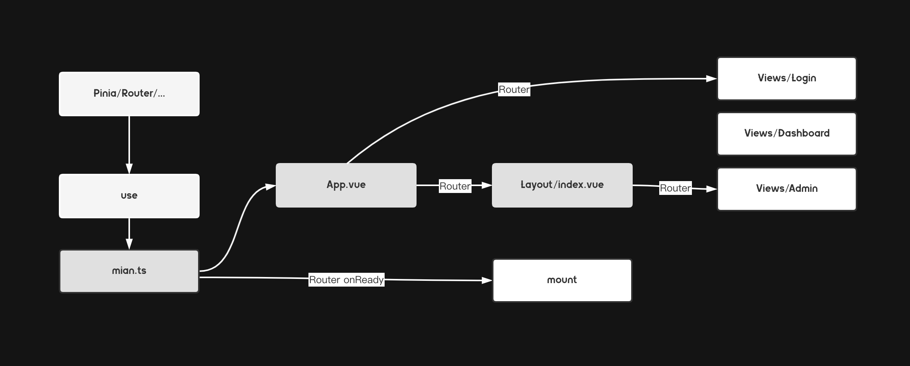

# admin

[](https://github.com/RichardLitt/standard-readme)

Vue3 start up template

the template is built based on VITE and Vue3, which is suitable for conventional Admin projects. Because it is temporarily used internally (not supporting internationalization)

## Table of Contents
- [Usage](#usage)
- [Structure](#structure)
    - [top directory](#top-directory)
    - [source code directory](#source-code-directory)
- [Documents](#documents)
- [Agreed](#agreed)
- [Contributing](#contributing)
- [Maintainers](#maintainers)

## Usage

```bash
git clone <this repository url>

cd admin

# Only allowed PNPM
pnpm install

# start dev
pnpm dev
```

## Structure

### Top directory
```bash
.
├── CHANGELOG.md
├── README.md
├── auto-imports.d.ts
├── components.d.ts
├── docs # documents
├── index.html
├── node_modules
├── package.json
├── pnpm-lock.yaml
├── public
├── scripts # some commonly used scripts
├── shims.d.ts # global type definition
├── src # source code
├── tsconfig.json
├── tsconfig.node.json
└── vite.config.ts
```
### Source code directory
```bash
.
├── App.vue
├── assets # static assets
├── components # components (auto imported)
├── config # configuration
├── directive # custom directives 
├── env.d.ts
├── hooks # custom hooks
├── layout # layout components
├── main.ts
├── mock # mock data
├── router # router
├── services # api/domains-services
├── store # pinia
├── styles.scss
├── utils # some commonly used functions
├── views
└── vite-env.d.ts # module type definition
```

## Agreed
How to perform git collaboration?
- [A successful Git branching model](https://nvie.com/posts/a-successful-git-branching-model/)

How to write commit message?
- [How to Write a Git Commit Message](https://chris.beams.io/posts/git-commit/)
- [Conventional Commits](https://www.conventionalcommits.org/en/v1.0.0/)

How to Code Review?
- [Code Review Best Practices](https://smartbear.com/learn/code-review/best-practices-for-peer-code-review/)

## Documents
Small note: documents stored in `docs` directory
## Contributing

PRs accepted.

Small note: If editing the README, please conform to the [standard-readme](https://github.com/RichardLitt/standard-readme) specification.

## Maintainers

[@branlice](https://github.com/branlice)
